# Pork Chips with Roasted Bell Paper, Stuffed with Pilaf Rice

`.                            A recipe by some weirdo                            .`

This is a recipe I've liked making and adapting over the past few years. I've only made it 3 or 4 times, but I keep on varying the ingredients and cooking style. Nothing here is super precise or finalized. *You could probably change any or every part of this and still have a great dish at the end of the day. Don't worry about following the directions down to the letter.*

You can click on the links below to jump to a particular part of the recipe.

[TOC]

## Ingredients

The recipe can be prepared in two ways: using simple rice or using pilaf rice. By simple rice, I mean the way you usually prepare rice -- using a rice cooker, boiling it, etc. Something easy. Mix some canned vegetables in it to make it more diverse and flavorful.

The pilaf rice will take about 1 extra hour to prepare, but will totally change the flavor of the entire recipe. It's a big payoff for a big effort, but it's optional at the end of the day.

##### Ingredients (Pilaf Rice | Recommended | 6-8 Servings)

- 2 cup. White Rice
- 3 Shallots & 1 Leek (any onion-type is fine; roughly the volume of half an onion)
- 3 tablespoons. Butter (you probably won't use *all* of it)
- 2 cup. Chicken, Fish, Beef Stock (optional)
- 1 cup. White or Red wine (optional)
- 6 Carrots and ~~Green Beans~~ (or any other vegetables that can be cut into little pieces and boiled or steamed)
  - My green beans went bad, so they appear in some picture, but not in the final dish. Totally recommend using green beans though.
- Parchment Paper (aluminum foil *might* also work)
- Fresh Rosemary, Bay Leaves, Thyme (optional)
- Salt, **Freshly Ground** Black Pepper

##### Ingredients (Pork Chips with Rice-Stuffed Bell Pepper and Roasted Cherry Tomato Garnish | Main Recipe | 2 Servings)

- Cooked Rice & Vegetables (Simple or Pilaf)
- Cooking Oil
- 2 Sweet Italian Sausage (any sausage is good; go with your favorite)
- 1 Bell Pepper
- 10ish Cherry Tomatoes (any tomato will work, but cherry will be best)
- Fresh Parsley (optional; freeze-dried is okay)
- Salt, **Freshly Ground** Black Pepper

If you don't own a pepper grinder, don't include it in the dish. The difference between fresh ground black pepper and pre-ground is night-and-day.

We start by describing the Pilaf Rice Recipe. Skip to the Pork Chip heading if you're not making Pilaf Rice.

# Pilaf Rice

### 0 Preheat Oven to F 400$^\circ$F

### 1 Prep The Onion-Types

Take your onion-types, and chop em up as small as you can. The fancy way to chop em up real small is called ["*Ciseler*" (youtube video; use the auto-translated subtitles to English)](https://www.youtube.com/watch?v=3L1FabGCOIE). This takes us from this:

Down to

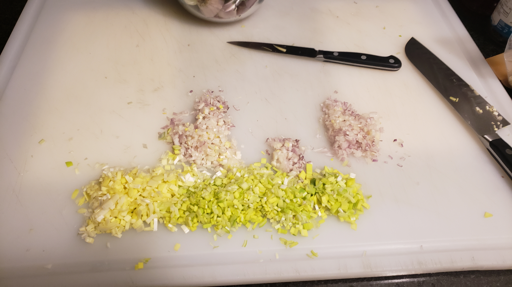

Take a good hunk of butter, about 1 tablespoon, and put it in a big oven-safe pot at <u>low heat on the stove</u>.

### 2. Sweat the Onion Types

Once the butter get's cloudy (~1 or 2 minutes), like below, add the shredded onion-types.

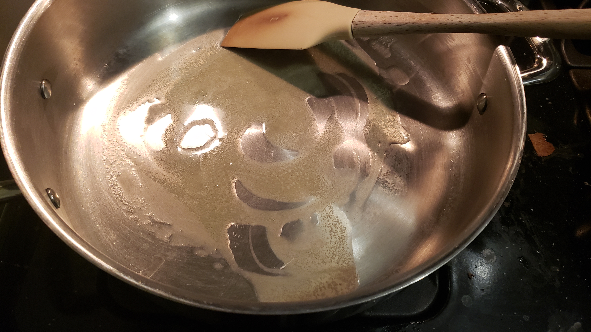

Keep the onion-types on low heat. Mix them around so that they are covered and soaked by the butter. If there's not enough butter to cover the bits, add more butter.

Continue with them on low-heat for about 30 minutes, stirring regularly. **Make sure that the onion-types never brown or fry at all, only sweat.** When they start to get dry, add some water and keep them on low heat. Stir regularly.

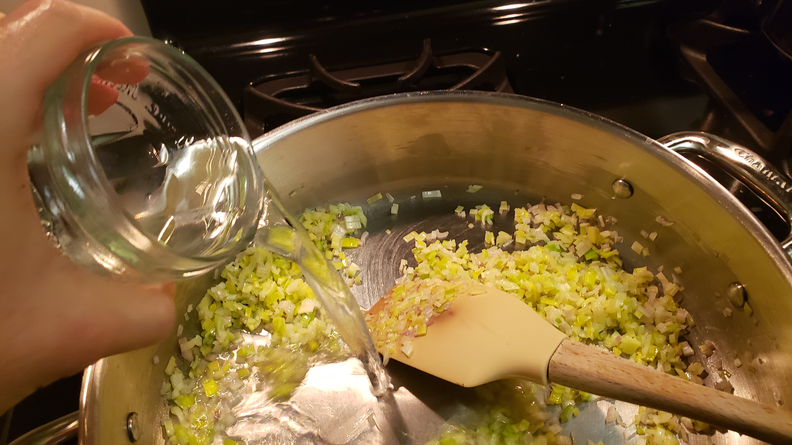

Over time, the onion-types (especially shallots and onions) will lose their color and become translucent. Most importantly, when you taste them, they will no longer be acid. Once the onion types are nice and soft and not-acid-at-all, they will be ready.

### 3. Prepare the Veggies

While the onion-types are taking their time sweating, we prepare and chop up our carrots & other veggies. Cut them into nice bite-sized pieces. Since my green beans went bad, I roughly doubled the amount of carrots shown below.

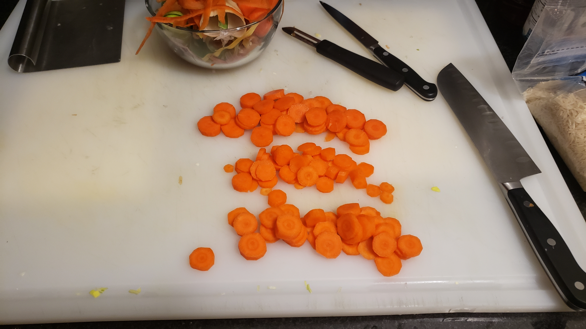

### 4. Add the Rice

Now the onion-types should be all done. Mostly transparent (leeks might be a bit green, that's fine), very soft, not-at-all acid. Then, add all the rice to the pot, along with 2 tablespoons of butter.

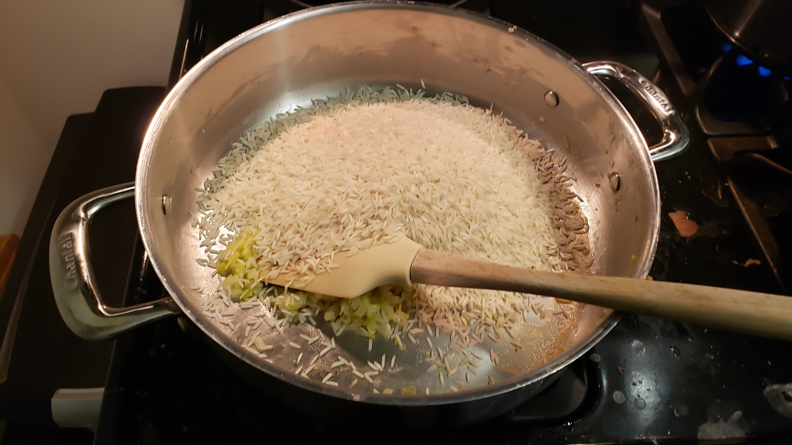

I didn't get a photo of the onion-types alone when fully cooked, but you can see they are not bright green green like before. Instead, they're shiny and muted in color. If you have no leeks, then they should be almost totally uncolored.

Mix all that butter, onion-type, and rice together, still on low heat. The goal is to make the rice shiny, also translucent, and well mixed with the onion-types. Mine was somewhat translucent, but not very. Normally it would be more clear than mine.

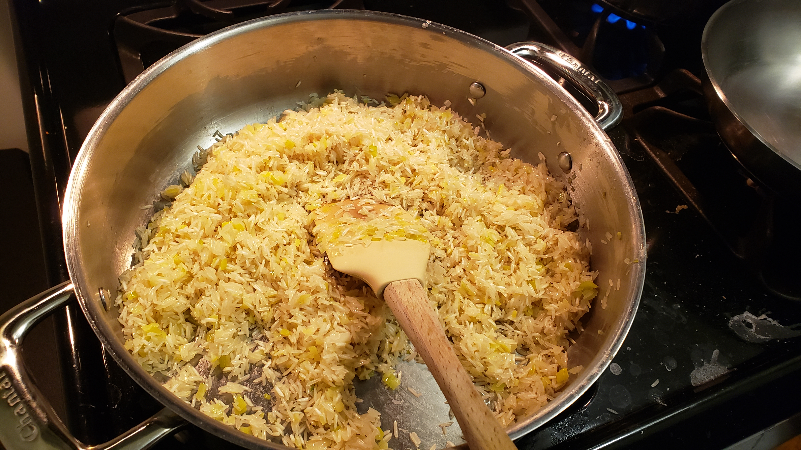

### 4. Add the liquid

Now, we add liquid. Check your rice to see how much water you're supposed to add. A good rule of thumb, if it's not written on the rice bag, is 3 cups of liquid for 2 cups of rice.

- If you have stock available, use 2 cups of stock
- If you have wine available, use 0.5 or 1 cup of wine (depending on how much you like wine)

I had neither on hand, so I just went with water.

Stir it all and make sure the rice evenly distributed in the pot. **Add the veggies now** (I forgot to take a picture of that; just add the veggies gently on top of the rice, they should be below the water line).

Add seasoning now. A generous pile of salt and **freshly ground** black pepper. Fresh nutmeg is also good. If you have it, add a few sprigs of rosemary, bay leaves, and thyme. It should look roughly like this but with veggies (ignore the paper for now).

### 5. Prepare a parchment cover for the rice

We're gonna cover the rice up with paper, so that the liquid can't escape but pressure also won't build up. This is what the parchment paper is good for. Start with a piece of paper larger than your pot.

Now fold it in half.

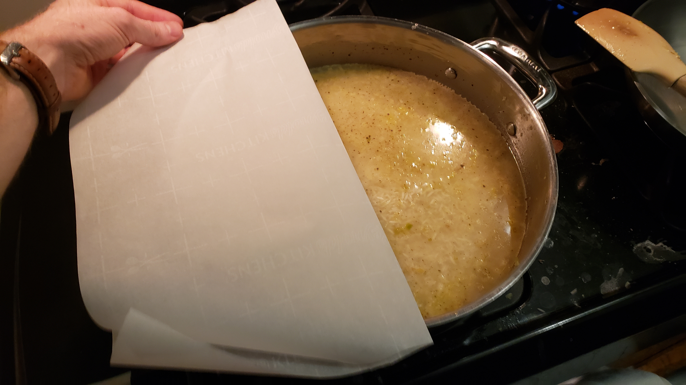

Now fold it in half again, just in the other direction.

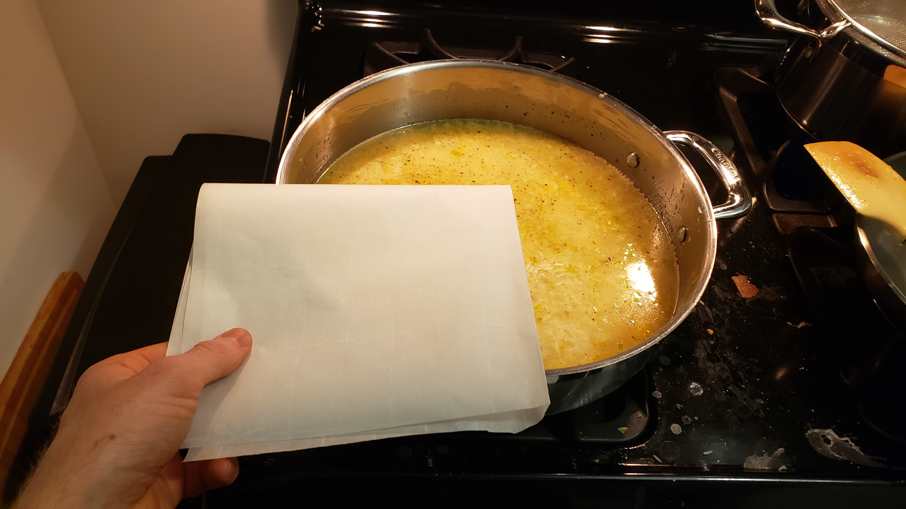

Now fold it again, so that the point at the top right remains at the top right (fold it so that the top left corner touches the bottom right corner)

Fold it a few more times, always maintaining the pointed tip.

Now, keeping the point of the parchement paper above the center of the pot, note where the edge of the paper touches the outside rim of the pot (my thumb does not move between the last and next photo)

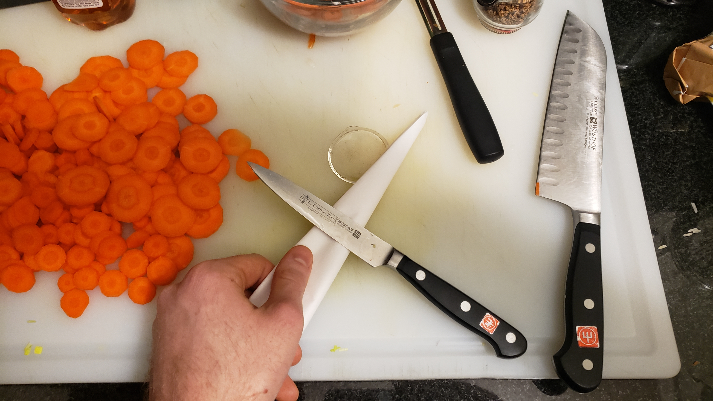

Cut the parchment paper right at that line, and also cut of about 0.5cm at the point of the paper. (I cut a bit too much off of the tip of the paper)

Unfold it and behold! A beautiful circular cover for your pot that will let  pressure out of the hold in the center, but not let any substantial amount of water out! **Before putting the cover on, use the stovetop to get the water to boiling temperature**.

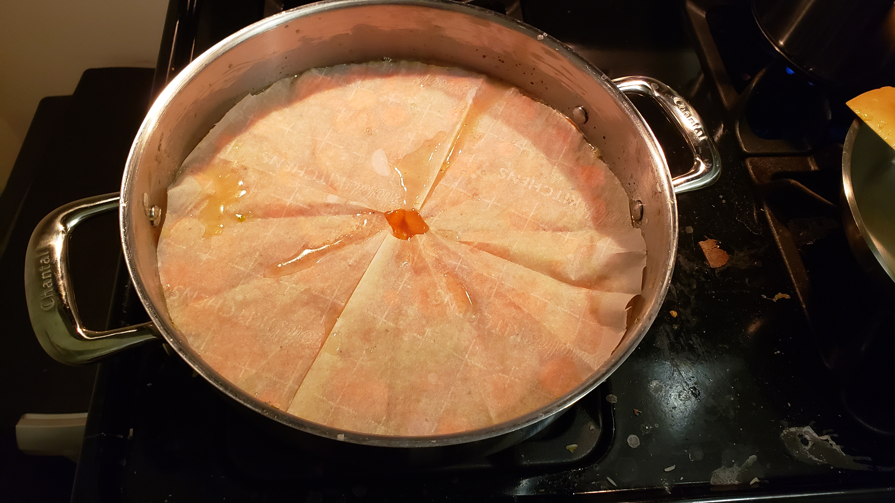

### 6. Put it in the oven!

Put a lid on your pot, and send it to the oven for at least 18 minutes!

- If you're making the full pork chip recipe, start working on that recipe now
  - Put the bell pepper and tomatoes into the oven about 10 minutes after the rice
  - Start frying the sausage parts about 15 minutes after the rice enters the oven

### 7. Take it out of the oven!

Open it up and look at it. It should smell lovely!

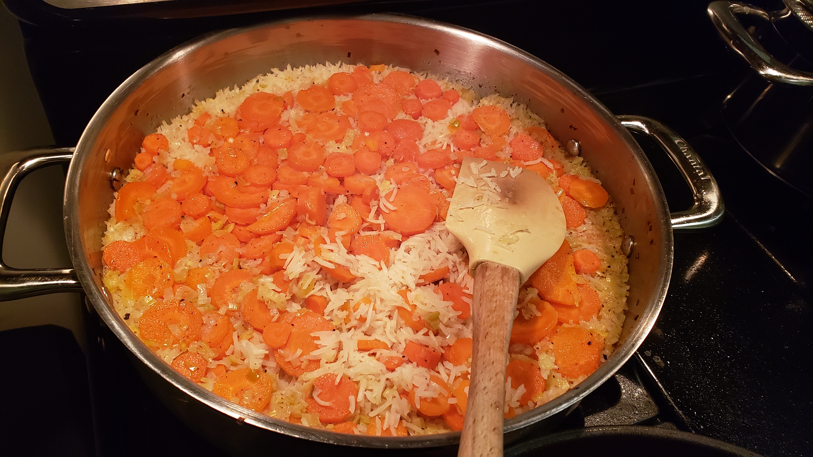

Check <u>underneath</u> the rice. It should look dry like in the picture below. If there's still water, put the rice back in the oven under the following conditions:

- Try a bit of the rice. If the rice is crunchy or too tough
  - Replace both the parchment paper lid and the pot's lid. Put it back in the oven for at least 4 minutes.
- If the rice is nice and soft
  - Put the pot back into the oven **without** either lid. We are just evaporating excess water now. Leave it for at least 4 minutes.
- After 4 minutes, repeat the process until the rice is done and the water is gone. (I added too much water, so I went an extra 8ish minutes. The below photo is after those extra 8 minutes)

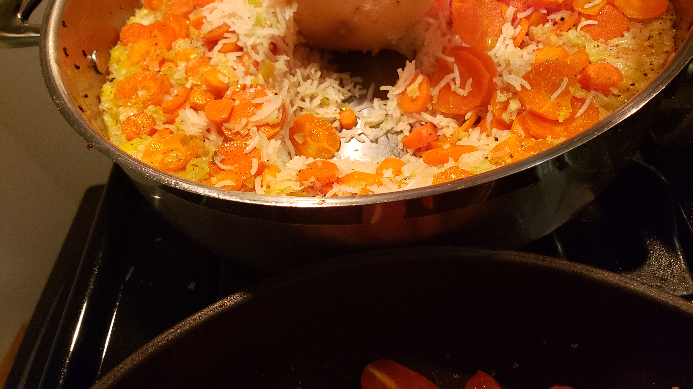

### 8. Done!

Remove the sprigs of thyme, rosemary, and bay leaves, if you added them.

Congratulations! You just made nice fancy pilaf rice! Taste it, it's pretty darn tasty!

# Pork Chips

This recipe is very simple compared to the pilaf rice.

### 0. Preheat Oven to 400$^\circ$F

That's the same temp as the pilaf rice. No need to worry there.

If you're making the pilaf rice, start this after step 6 there. You should have just put the rice in the oven.

### 1. Prep the Veggies

Take your bell pepper, remove the seeds and stem, and split it in half.

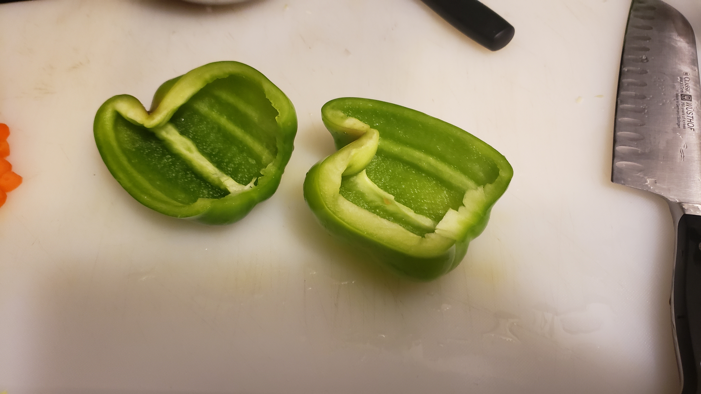

Split your cherry tomatoes in half.

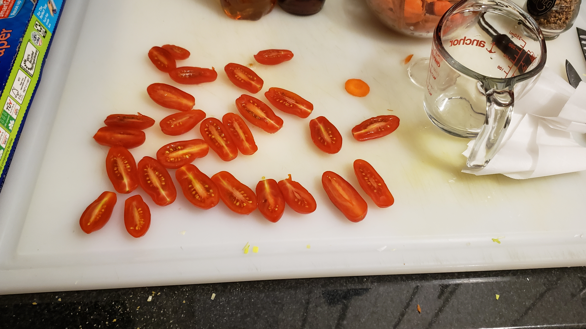

Load them all up on an oven-safe surface and douse them with salt and **freshly ground** black pepper. If you're a fan of olive oil, drizzle some on the tomatoes, but not the bell peppers. It'll just give a bit more flavor to the tomatoes. I'm not big on olive oil, so I only went with salt and pepper.

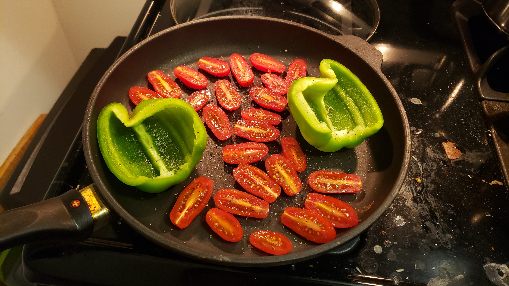

### 3. Bake the Veggies

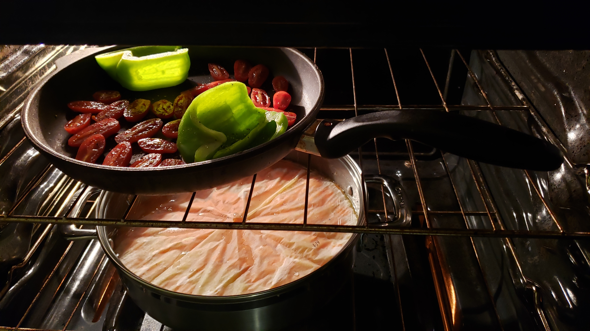

Send them into the oven for 8-10 minutes. When the are done, the tomatoes should look *a bit* dry and the bell peppers should be super soft, with a puddle of bell pepper juice in them.

You can just barely see the puddle of juice in the bottom right of the following photo (which is from later in the recipe):

### 4. Prep the Pork Sausage Chips

We are going to cut each sausage into 4 parts. Lay the sausage on a cutting board. Cut along the long way of the sausage.

Once that is done, split it down the middle-most cross section

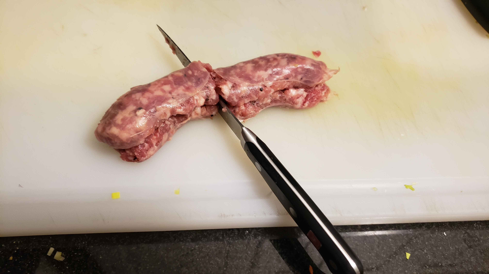

We should end up with 4 pieces of ground pork. **Make sure the sausage casing is still attached.** That's what makes them into chips.

### 5. Fry the Chips!

Place each sausage part into an <u>oiled frying pan on high heat</u>, with the **sausage casing face-up, away from the pan**.
Season with salt and *freshly ground* black pepper.

I messed up and accidentally put one in face-down, which obviously looks different on the left, in the picture below

After a couple minutes of them frying, flip them over. Once you flip them over, they should stretch out. When it gets hot, the sausage casing shrinks a bunch, making the overall sausage part bend into the shape of a potato chip. That's why I call them pork chips -- they're pork that's shaped like a potato chip.

You can really clearly see it curve at the 10 second point of the video below.

<iframe width="560" height="315" src="https://www.youtube.com/embed/6CMk4UP3iq8" frameborder="0" allow="accelerometer; autoplay; encrypted-media; gyroscope; picture-in-picture" allowfullscreen></iframe>

Once they're fully cooked (1 or 2 more minutes), then take them off the heat.

## Part 2: Plating

All the food is done; it's fresh and hot! Now, let's put it all together and make it look kinda nice!

### 1. Bed of Rice

Put down a bed of rice, about the volume of 1 fist.

### 2. Add a rice-stuffed bell pepper

Fill a bell-pepper with the rice, and place it on top of the bed of rice.

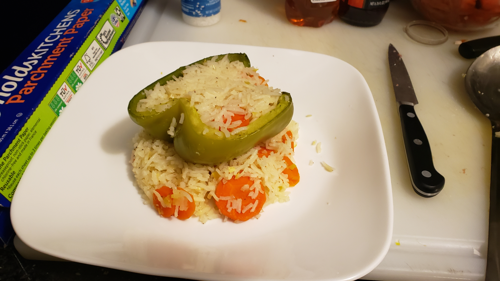

### 3. Add tomato garnish

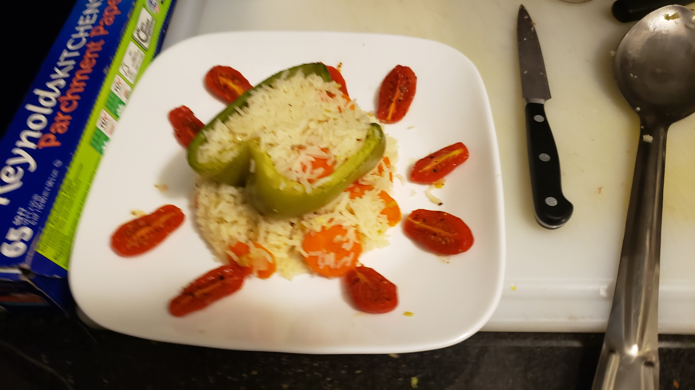

### 4. Place 2 sausage chips

You can have more chips if you want, but it looks best when there's 2 of them, and one of them rests on top of the other one.

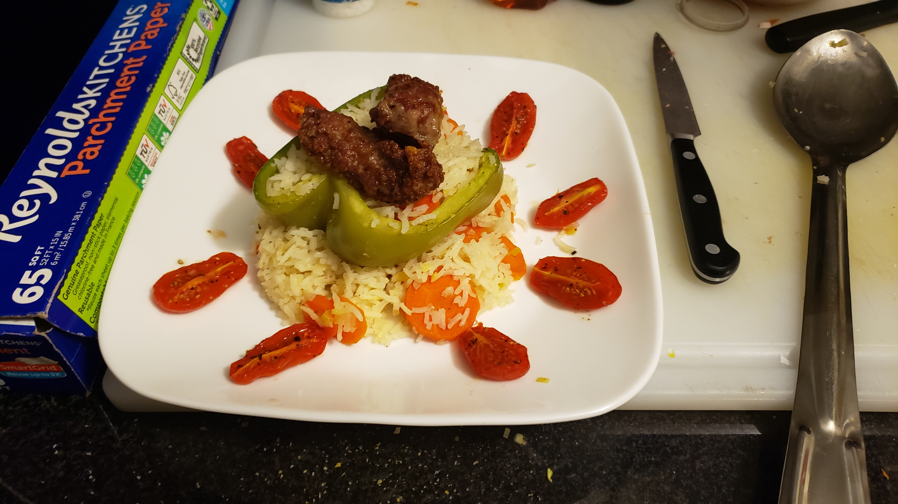

### 5. Sprinkle on some chopped up parsley

Chop up some parsley really finely, and sprinkle it on top. A bit of green goes a long way to making food look good!

# Voila! It's done! Enjoy good food!

